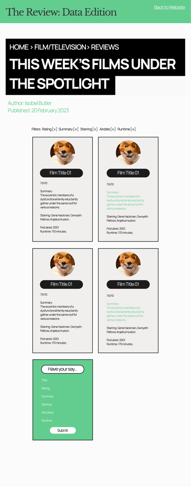

# Application Website

## Table of Contents
1. [Planning](#Planning) 
2. [Building](#Building)  
3. [Debugging](#Debugging)

## Planning
As with my other projects, I planned how the design of the project would look on Figma before starting, and from there threw myself into trying to learn about objects, and how to access their data. I spent a long while on lots of different forums, as I couldn't find an object which seemed to be laid out in the same way. Eventually it all came together during the build.

### Original Figma Design:



## Building
This project was the one I found the most difficult, but was also extremely rewarding, I learnt alot through making it, and really enjoyed the challenges and satisfaction of finally feeling like it made sense.

1. Recreate the figma design using HTML and CSS, with dummy cards mimicking what the JS would create, so that I could get the styling done first.
2. Create a loop that would run through the object, and render the information onto the website.
3. Add a way for the user to filter the displayed information by category.
4. Create a form that allow users to submit and display their own film.
5.  

## Debugging

### Issue: I couldn't work out how to access the titles, or the data within them.


**Solution:**  
```javascript
let html = '';

for (let i = 0; i < Object.keys(movieData).length; i++) {
  let card = Object.values(movieData)[i]; // BREAKTHROUGH!!!! - Values lets you access the data of each title.
  let title = Object.keys(movieData)[i]; // Keys lets you access the the actual title. So it goes object > keys > values.
  html +=
    `<div class="card">
    
    <h4>${title}</h4>
    <p>${card.rating}/10</p>
    <p>
      Summary: ${card.plot}
    </p>
    <p>Starring: ${card.cast.join(', ')}.</p> 
    <p>First aired: ${card.year}.</p>
    <p>Runtime: ${card.runtime} minutes.</p>
  </div>
    `
    ;  
}

document.querySelector('.card-container').insertAdjacentHTML('beforeend', html); 
```

### Issue: I could access the data of the title the user added, but not the title itself.

**Solution**
```javascript
movieData[userTitle.value] = userMovie; //Breakthrough!! using [] means you can access the .value rather than using dot notation
```

### Issue: I could access the data the user added to the object in the console, but couldn't work out how to render it onto the page.

**Solution**
```javascript
let userCard = Object.keys(movieData).pop(); 
let userInfo = Object.values(movieData).pop(); 
  ```

### Issue: When the user submitted a card, it would add one at first, then would duplicate it in increasing intervals each time I resubmitted the same information, following the Fibonacci sequence.

**Solution:**  

I realised that the tiny culprit was staring me right in the face! I had thought it might be due to using a let variable, but that didn't make sense, and then eventually clocked I was adding extra to the existing HTML each time rather than changing it! I had used the code that worked in the loop, forgetting I was no longer was looping!

Before:
```javascript
html +=
```

After:
```javascript
html =
```

### Issue: I couldn't find a way for the user to submit more than one cast member in the form.

I originally had three form fields for the user to submit three names to. However, I could only get the first to be added to the object. I changed approach and decided to use one field, with the instruction to divide names by a comma and space. The data the user submitted would be stored in an array. I created a new variable called *starringArray* which would then split these names using the split method: *.split(", ")*. 

**Solution**
```
let userStarring = document.getElementById('form_starring');
userStarring = userStarring.value;
const starringArray = userStarring.split(", "); // 
```